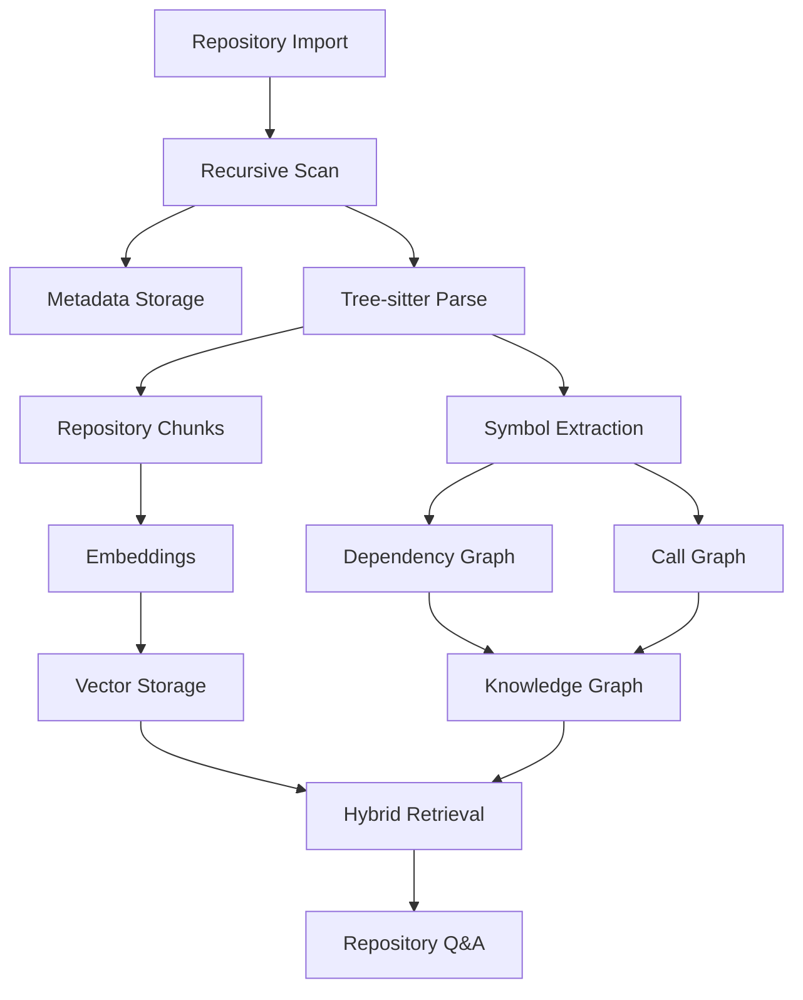
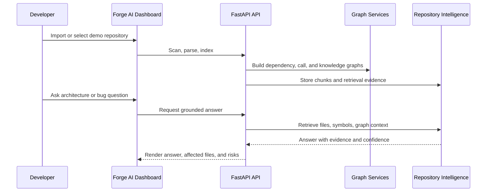

# Architecture Diagrams

These Mermaid diagrams summarize the production release architecture and demo
workflow for Forge AI.

## Runtime Architecture

```mermaid
flowchart LR
  user[Developer] --> frontend[Next.js Dashboard]
  frontend --> api[FastAPI Backend]
  api --> services[Service Layer]
  services --> parser[Tree-sitter Parser]
  services --> metadata[(SQLite Metadata)]
  services --> vectors[(SQLite Vector Store)]
  services --> graph[Graph Engine]
  graph --> neo4j[(Neo4j)]
  graph --> networkx[NetworkX Fallback]
  api --> worker[Worker Health Service]
  worker --> redis[(Redis)]
```

## Repository Intelligence Pipeline



## Demo Workflow


